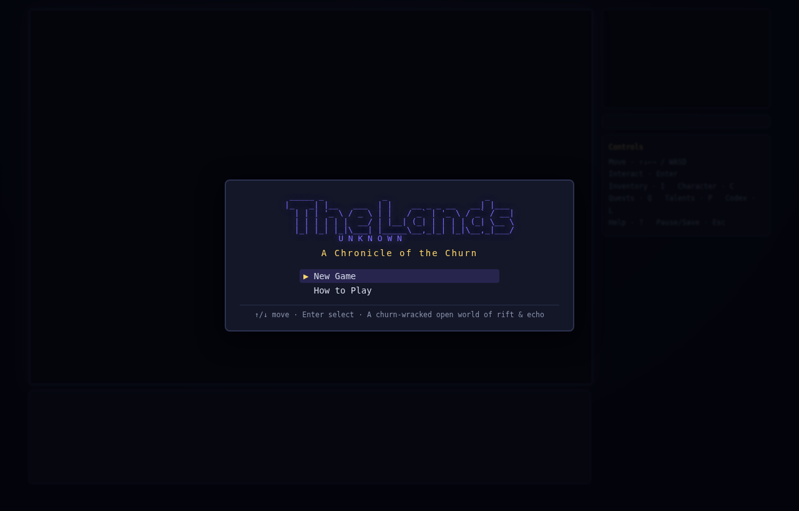
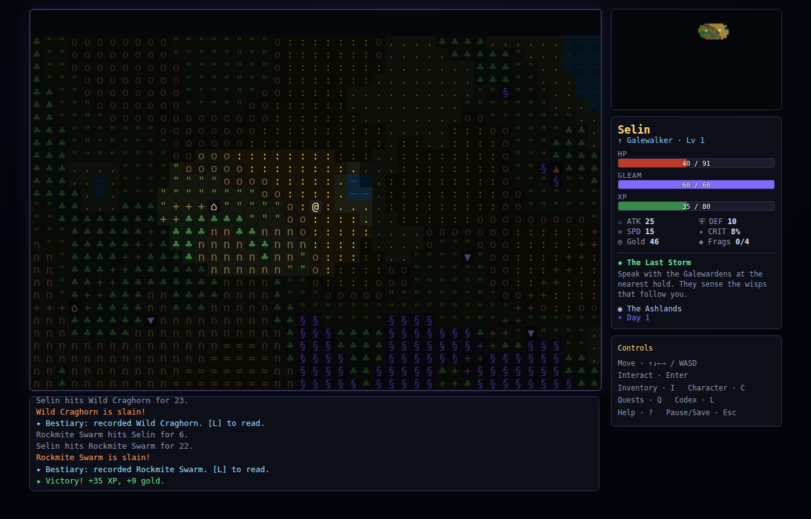
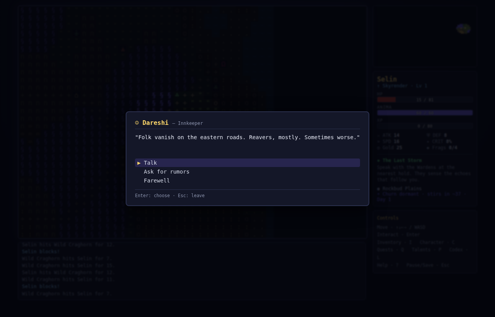
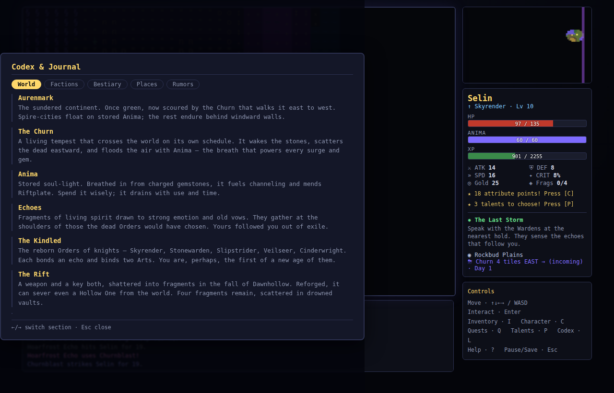
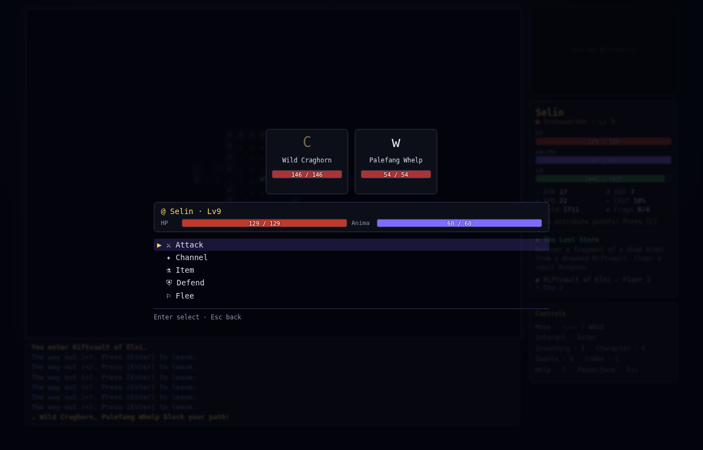
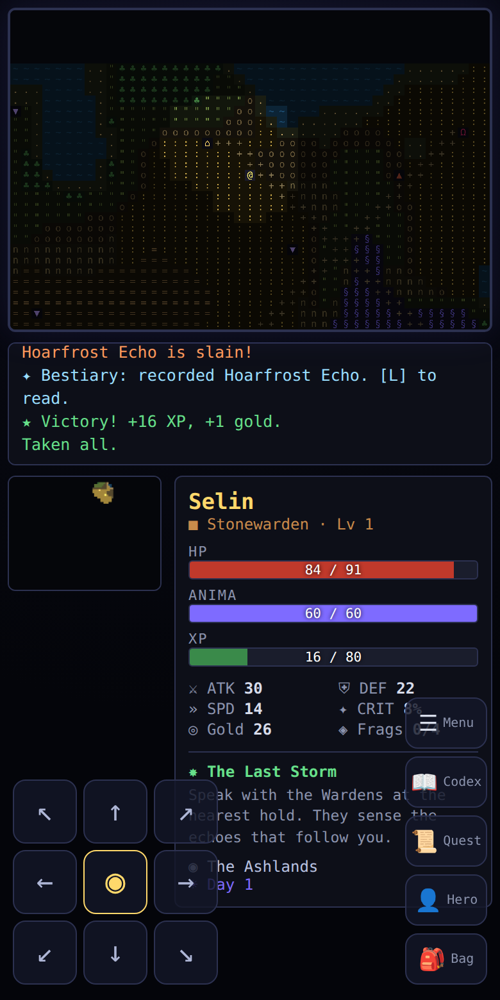

# The Lands Unknown
### *A Chronicle of the Churn*

A large, open-world **ASCII RPG** that blends the freeform exploration and skill-by-use
progression of **The Elder Scrolls**, the deep procedural systems of **Dwarf Fortress**,
and the emergent, story-soaked pull of **RimWorld** and **Minecraft** — set in an
original death-and-memory world of the Churn, of Anima, and the unforgotten dead.

Wander a seed-generated continent, channel the Arts, hoard randomized Riftgear, gather
rumors from a town full of talkative NPCs, fill in a discovery Codex as you explore —
and, when you are ready, descend into ruined Dawnhollow to face the final boss:
**Vethra, the Gloammother**.

It runs entirely in the browser with **no build step and no dependencies**.

## ▶ Play it now

**[▶ Play in your browser (githack)](https://raw.githack.com/mountaindrowner/TheLandsUnknown/claude/eldest-girl-dwarf-fortress-ejhqoz/index.html)**

```
https://raw.githack.com/mountaindrowner/TheLandsUnknown/claude/eldest-girl-dwarf-fortress-ejhqoz/index.html
```

> The githack link serves the game straight from this branch — it works as long as the
> repository is **public**. If the page doesn't load, the repo is likely private; make it
> public (or use a local run, below) and the same link will work.

**Run locally instead:** clone the repo and either open `index.html` directly, or serve it:

```bash
python3 -m http.server 8080      # then open http://localhost:8080
```

**📱 Mobile:** fully playable by touch. On phones/tablets you get an on-screen **D-pad**
(with an 8-direction pad + center *Action*), **swipe-to-move / tap-to-interact** on the map,
quick-buttons for Bag / Hero / Quest / Codex / Menu, **tap-to-select** menus, and
tap-an-enemy-to-attack in combat. The layout reflows for small screens automatically.








---

## Extending the game — the content framework

The game is **data-driven**. You can add entire regions, creatures, gear, NPCs, dialogue,
rumors, quests, and lore in **content packs** — plain data files — *without touching engine
code*. A pack is one call to `TLU.Content.register({ ... })`; the registry merges it into
the live tables at load.

- **Author's guide:** [`content/CONTENT_GUIDE.md`](content/CONTENT_GUIDE.md) — full schema + examples.
- **Worked example:** [`content/example-pack.js`](content/example-pack.js) — a mini-region (a hold, two
  creatures with lore, a unique blade, affixes, a bard NPC, rumors, a travel event, a
  side-quest, codex entries) added in ~80 lines.
- In the browser console, `TLU.Content.summary()` shows what's loaded.

```js
TLU.Content.register({
  id: 'my-pack',
  bestiary: [ { id:'frost_wisp', name:'Hoarfrost Echo', glyph:'i', lvl:3, hp:26, atk:11,
                def:2, spd:15, biomes:['coast'], lore:'Codex entry shown on first kill.' } ],
  npcs:    { bard: { role:'Bard', glyph:'♪', greet:[...], talk:[...], bye:[...] } },
  quests:  [ { id:'...', name:'...', stages:[...], onComplete:{...} } ],
  // ...materials, weapons, prefixes, uniques, abilities, skills, orders, events, rumors...
});
```

## Designing further

[`DESIGN_QUESTIONS.md`](DESIGN_QUESTIONS.md) is a working questionnaire to refine the
gameplay loop, progression depth, endgame, replay variance, and a set of **original
"unique spin"** mechanics (the storm as a duelable clock; wisp-bonds with opinions; a
soul-economy where every kill arms the apocalypse; asynchronous dynasties). Answer it and
the next build follows from your choices.

---

## The world

> *The Churn walks the world from east to west, and where it passes the stones wake
> and the souls of the dead drift like embers on the wind. You are one of the Unkindled —
> born without the gift the temples promised, cast out of the spire-cities to wander the
> sundered marches. But the echoes have begun to gather at your shoulder...*

- **Aurenmark** — a sundered continent crossed by the living **Churn**.
- **Anima** — the soul-light shaken loose from the dead by the Churn, breathed from charged gems to fuel the Arts.
- **Echoes** — fragments of the dead that gather at the shoulders of the would-be **Kindled**.
- **The five Orders** — Skyrender, Stonewarden, Slipstrider, Veilseer, Cinderwright — each
  binding two of the eight Arts. The Kindled carry an echo of the dead.
- **The Rift** — a soul-severing weapon shattered into four fragments, scattered in drowned vaults.
- **The Hollow Ones** — old, patient, hungry forces. **Vethra, the Gloammother**, is the eldest that wakes.

### Controls

| Action | Keys |
|---|---|
| Move | Arrow keys / `WASD` / `HJKL` (+ `YUBN` diagonals) |
| Interact · enter site · take stairs | `Enter` or `E` |
| Inventory | `I` |
| Character & spend level-up points | `C` |
| Quests & bounties | `Q` |
| **Codex / Journal** | `Shift+L` |
| Pause / Save / Quit | `Esc` |
| Help | `?` |

The game **auto-saves** as you travel and on major events.

---

## What's in it

- **Procedural open world.** A value-noise continent with nine biomes, holds (towns),
  drowned Riftvaults, reaver camps, roads, the roaming Churn, and a far-eastern danger gradient —
  every world is reproducible from its seed.
- **A world that talks.** Towns are populated with named, archetyped **NPCs** — innkeepers,
  gem-merchants, drillmasters, guards, scholars, wanderers, street children, ashpriests,
  riftsmiths — each with deep pools of greetings, banter, and lore. Ask for **rumors** to
  hear flavor or to get nearby vaults, camps, and the warlord's lair **marked on your map**.
- **A discovery Codex.** A journal that fills in as you play: World lore, Factions, a
  **Bestiary** that records each creature you slay, **Places** you've charted, and every
  **rumor** you've heard. Discovery is the pull.
- **Ambient life & travel events.** Evocative barks while you roam, plus non-combat
  micro-events — an echo’s gift of Anima, a traveler's cairn, a roadside shrine, a wandering
  healer, tainted water — that keep the road surprising.
- **Skill-by-use progression (Elder-Scrolls style).** 21 skills across combat, armor,
  channeling and utility that level *through use*; skill-ups feed your character level
  and grant attribute points you allocate freely.
- **Mountains of randomized loot.** Seven material tiers × weapon/armor bases ×
  prefix/suffix affixes, plus hand-authored artifacts (the living Riftblade *Gravewind*,
  *Kindled Riftplate*, *Cinderfall*). Rarities from common to artifact.
- **Final-Fantasy-style turn-based combat.** Initiative order, crits, elements,
  armor-piercing, blocking, status effects (burn/bleed/stun/bound/fear/guard/evade…),
  fleeing, and a multi-phase final boss that spawns murderous shadows and escalates.
- **Roguelike dungeon delving.** Multi-floor vaults with room/corridor generation,
  raycast field-of-view, wandering monsters, chests, infused gems, and Rift fragments.
- **Quests in many directions.** A main arc (gather the Rift, end Warlord Varen, descend
  Dawnhollow) plus faction side-quests and bounties — pursue them in any order.
- **Towns & economy.** Rest at inns, buy/sell from refreshing merchant stock, pay
  trainers, and counsel with the Wardens. Bartering improves with use.

---

## Project layout

```
index.html            # loads everything in order (no build step)
styles.css            # terminal / FF-menu aesthetic
src/
  rng.js              # seedable deterministic RNG (Mulberry32)
  data/
    lore.js           # world flavor, orders, gems, name generator, biome flavor
    skills.js         # skill definitions + XP curves
    items.js          # materials, bases, affixes, loot tables, uniques
    abilities.js      # channeling powers + enemy moves
    bestiary.js       # enemies, mini-boss, final boss, scaling
    quests.js         # main arc + side quests
    dialogue.js       # NPC archetypes, rumors, codex, barks, travel events
  content/
    registry.js       # content-pack loader/merger (the modding framework)
  world.js            # overworld generation (biomes, sites, roads)
  dungeon.js          # dungeon floor generation
  player.js           # character: attributes, gear, derived stats, leveling, codex
  combat.js           # turn-based battle resolver
  save.js             # localStorage persistence
  render.js           # canvas ASCII viewport + minimap
  ui.js               # HUD + generic menu rendering
  game.js             # state machine: movement, encounters, quests, discovery
  screens.js          # keyboard input + every overlay screen (+ end screens)
  touch.js            # mobile/touch controls (D-pad, swipe, tap-to-select)
  main.js             # bootstrap
content/
  CONTENT_GUIDE.md    # how to author content packs
  example-pack.js     # a worked example pack
test/
  sim.js              # headless logic tests (worldgen, loot, combat, final boss)
  browser.js          # full desktop UI playthrough in Chromium
  mobile.js           # phone-emulated touch playthrough
  shots.js            # screenshot capture
DESIGN_QUESTIONS.md   # refinement questionnaire (loop, depth, endgame, unique spin)
```

---

## Tests

```bash
npm test               # headless logic simulation (no browser needed)   -> 828 checks
npm run test:browser   # full desktop UI playthrough in Chromium          -> 24 checks
npm run test:mobile    # phone-emulated touch playthrough in Chromium      -> 15 checks
```

The logic suite generates worlds, rolls hundreds of items, levels a character, runs
dozens of battles, and verifies a maxed champion can defeat the final boss. The browser
suite drives the *real* UI from the title screen through chargen, every overlay, all town
services, an NPC conversation, the codex, a dungeon entry, normal combat, and a
**final-boss victory** — asserting zero console errors throughout.

---

## A note on the goal

Built to a single brief: *make it completely playable; reskin the world from an obvious
inspiration into something original but kindred; pack it with NPC dialogue and lore; make
it enthralling like the games that pull people in for hundreds of hours; and give me a link
to play.* Remember the dead. Outlast the Churn.
